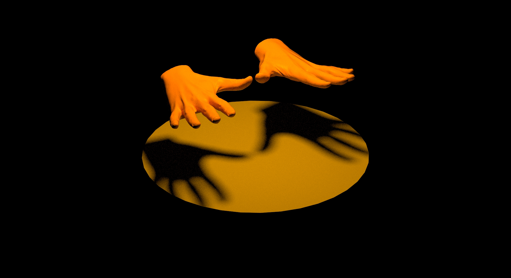
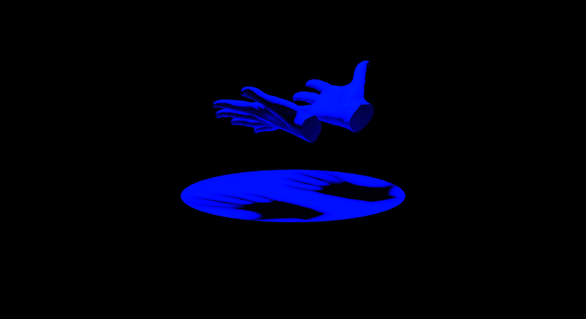

### Project Proposal

I’m interested in how atmosphere is created through sound and light. Possibly because I'm the son of an opera singer and have a fascination for set design tucked away somewhere. I'm inspired by how light and sound interplay in Annie Tådne's "[Boberg 1](https://tadne.se/performance/boberg-1/)" and Felix Faire's "[Contact](https://felixfaire.com/project/contact)" but feel the tabletop is quite an over-explored interface. Olafur Eliasson talks a lot about how work is created in the moment it is perceived by the viewer ("[Rainbow Assembly](https://olafureliasson.net/archive/artwork/WEK110117/rainbow-assembly)" is a good example of this).

This made me wonder if light can be used as an interface, for example, to create tone, compositions and perhaps even dialog. Possibly by measuring for example brightness, color, source (artificial or sun), and duration. I'm not yet sure if the light source is to be static and there for the viewer to manipulate, or if it is free for the audience to bring in their own dynamic light sources. The output is a synthesizer that produces an array of different tones, which makes it possible to compose a melody by playing with the light in certain ways. Does a complex synthesizer count as multiple outputs? If not, I'd have to rethink and possibly add a visualization (if this doesn't interfere with the light sensors) or vibration feedback. This idea could develop into a game, an instrument, a performance or perhaps even a sort of design for therapy.

#### Quick mockups of my vision, probably nothing like the final outcome will look like:

