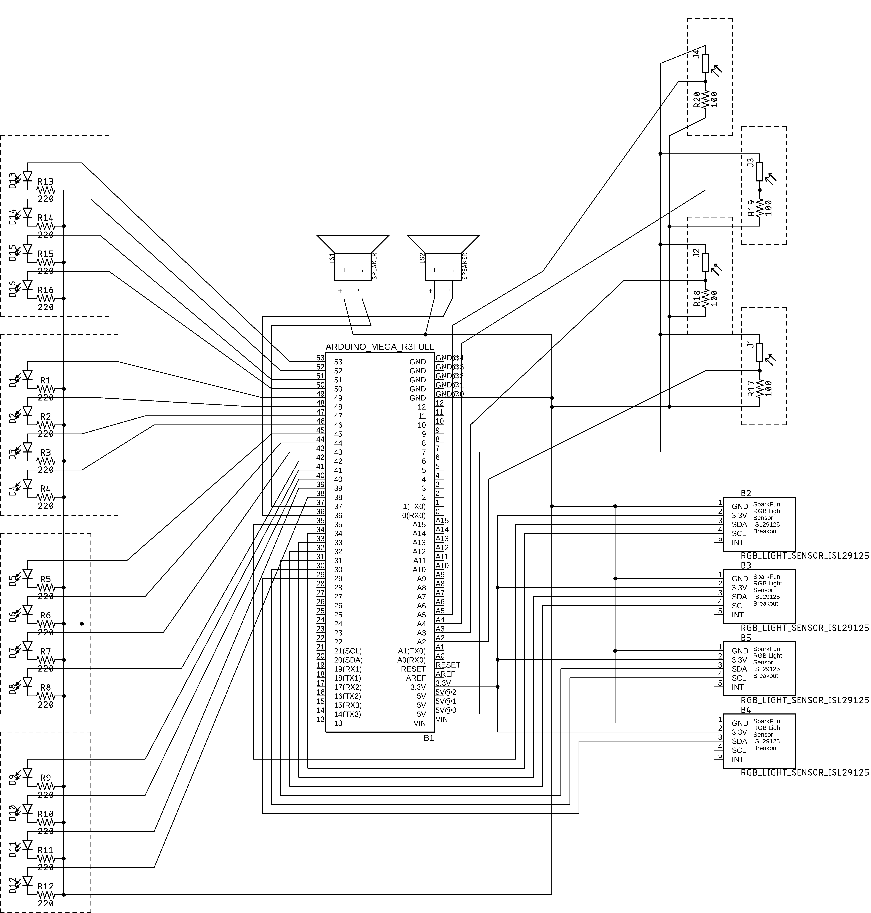

# Theremin

Experiemental instrument that uses light as an interface to output tones & melodies. It can be played by a single player or as a dialog between two.

## Dependencies

1. SoftWire
2. ISL29125 SoftWire
