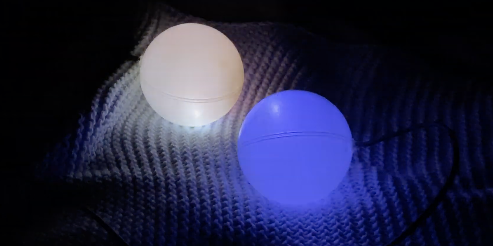

# Log 7

### Using millisec instead of delay

Fading my led torches is all fun and games until you want to do something in parallel. The delay function will block your loop. The solution to this is to use milliseconds.

### Fading the LED torches

Another solution had to be found, and hence I settled on a function that would allow me to use time and a sine wave to fade the LEDs. Not only does this solve the timing problem, the sine wave fade is much better looking than the linear for loop fade.

https://youtu.be/ubPF3j_LVvM

https://youtu.be/BusSimIUbJU

```c++
int LEDval, LEDval2;

void light () {
      LEDval = 128 + 128 * sin(2 * PI / frequency * (millis()));
      analogWrite(ledA1, LEDval);
}
```



In order to have the two run asynchonously, one has to run on an offset. This can be easily achieved by using a sine curve on one, and a cosine curve on another value.

```c++
LEDval = 128 + 128 * sin(2 * PI / frequency * (millis()));

LEDval2 = 128 + 128 * cos(2 * PI / frequency * (millis()));
```
