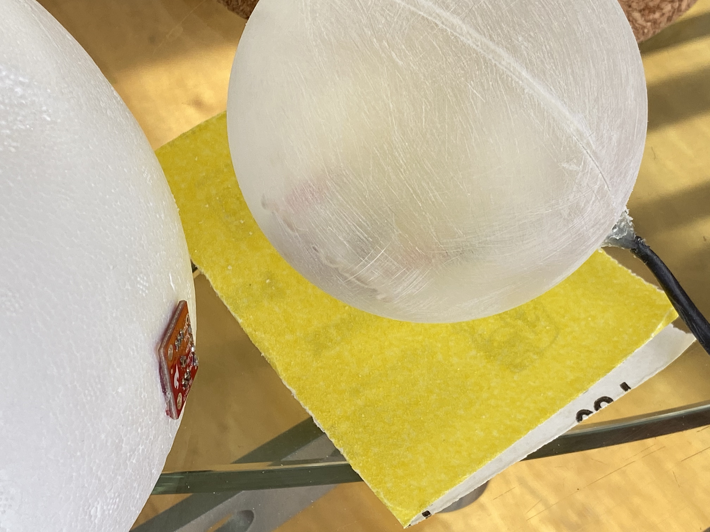
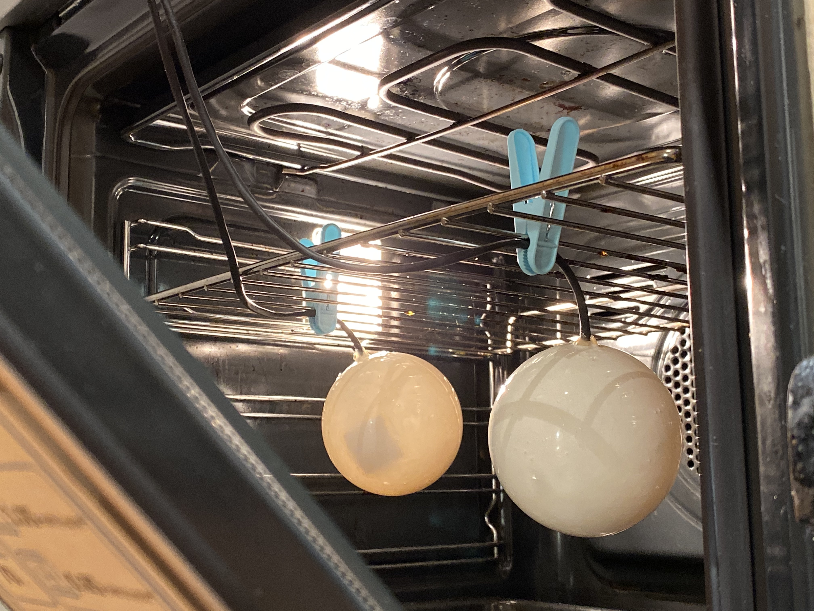
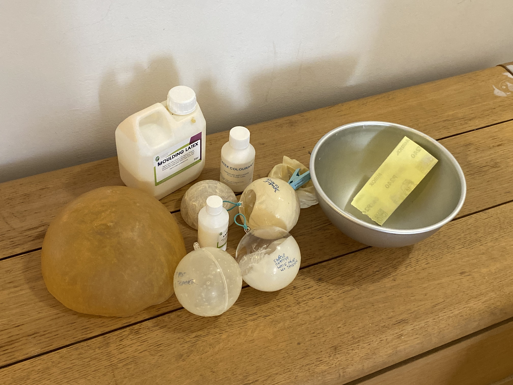
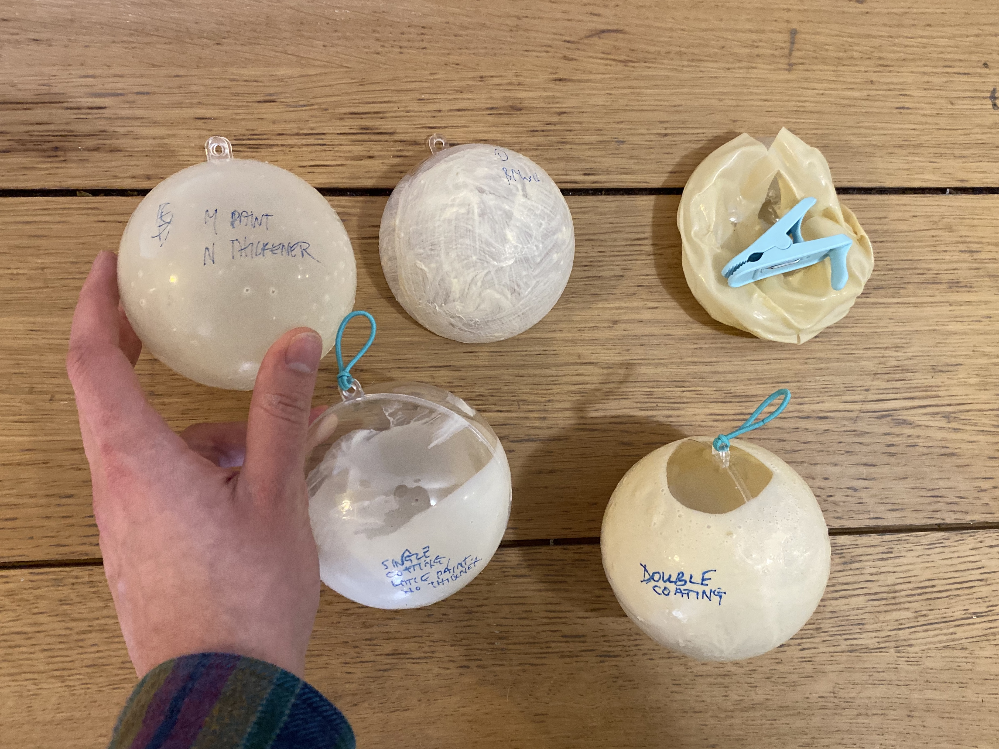

# Log 8

#### Complex tones

This by far became the most challengin aspect of my porject. By standard, the tone function is limited to a single output. Also, the square wave that the Arduino produces sounds harsh on the ears. Creating something that would be more complex than a simple one to one reading of the sensor values wasn't going to be easy.

https://youtu.be/zJvzaO4Gy4U

https://youtu.be/a39MprkitpA

#### Distance sensor

In order to create a threshold in which the instrument turns on, I used the photoresistor readings. If the value goes above a cetrain amount, a tone will be played, whereas it will be stopped should the value drop. I have basically created a distance sensor from photoresistors.

#### Finding a better material for the enclosure

Went to another art supply shop. Silicone/latex seems the way to go. He only had the brown one though, albeit selling pigments. Pigments wont work because they likely make the material opaque. I need it semi translucent. Need to order this stuff on the internet. I ended up using a mixture of latex thickener and white color to create the desired effect.

The LED torches were a challenge to coat. I initially wanted to create a surface that would monotonously disperse light just like the Playstation controllers. I quickly discovered that the tactility of latex adds a lot to my project. The plastic baubles were suddenly satisfying to grip, didn't slip and looked more approachable. Latex became a signifier, I guess?

