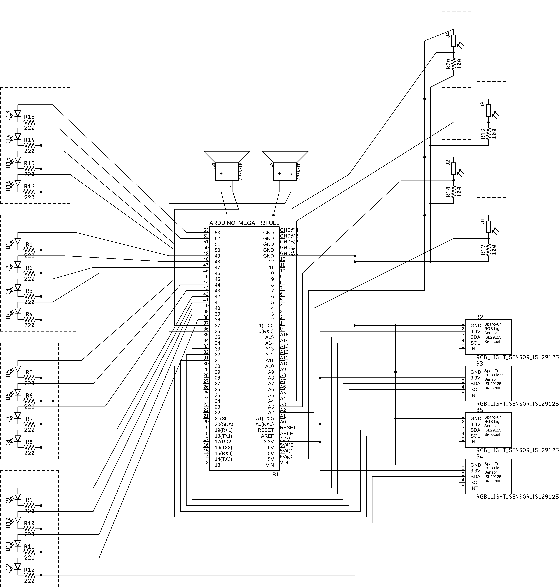

# Log 9

## Redoing the circuit diagram

I figured that the fritzing diagram I made was not actually a schematic. Since I had to redo this, I took the challenge to make it in Eagle, the program with one of the scariest interfaces I have ever seen (or lack thereof). Getting all of my sensors onto a single diagram proved to be quite difficult, as I quickly ran out of space for my nets.

## Distance sensor

In order to create a threshold in which the instrument turns on, I used the photoresistor readings. If the value goes above a cetrain amount, a tone will be played, whereas it will be stopped should the value drop. I have basically created a distance sensor from photoresistors.

## Enclosure and sensors work together

Things are coming together now. I was slightly concerned the color sensors wouldn't work properly with the reddish latex enclosure but it works perfectly. Interestingly I can use shadow instead of light, and it will have the inverted effect on my sensors. This is an alternative way of interacting with the instrument, and an ally I could further explore.

https://youtu.be/4mwHbQ01Eho
