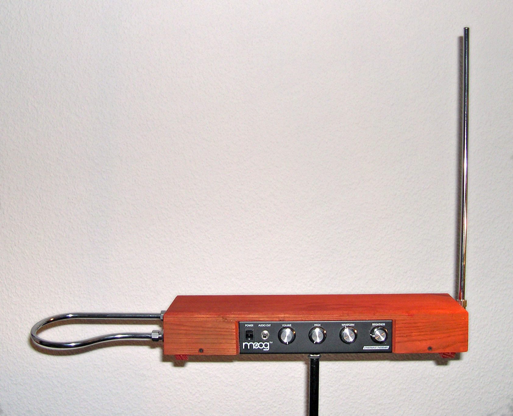

# Log 10

## Naming my instrument

My aunt hinted that what I had created already existed, and was called a **Theremin**. Albeit this being an instrument that works with a single input and a single output, the core concept seemed to be similar to mine: to create music without direct physcial interaction. Therefor, I chose to adapt the name Theremin. Here is a short description of the original instrument, found on Wikipedia:


_Theremin. Image taken from wikipedia._

**_The theremin is an electronic musical instrument controlled without physical contact by the thereminist. It is named after its inventor, Léon Theremin, who patented the device in 1928._**

## Adding a calibration routine

When working with light, calibration is crucial. Light changes constantly—even dark rooms differ in ambient lighting. I could'nt propperly showcase my project in CCi as the building is covered in glass. However, my feedback was to add a calibration routine to my script, in order for Theremin to automatically adjust to ambient light levels. This code represents a single calibration routine, taken from an Arduino tutorial:

```c++
void setup() {
  pinMode(13, OUTPUT);
  digitalWrite(13, HIGH);

  while (millis() < 5000) {
    sensorValue = analogRead(sensorPin);

    if (sensorValue > sensorMax) {
      sensorMax = sensorValue;
    }

    if (sensorValue < sensorMin) {
      sensorMin = sensorValue;
    }
  }
  digitalWrite(13, LOW);
}

void loop() {
  sensorValue = analogRead(sensorPin);

  sensorValue = map(sensorValue, sensorMin, sensorMax, 0, 255);

  sensorValue = constrain(sensorValue, 0, 255);

  analogWrite(ledPin, sensorValue);
}
```

I have done this for the photoresistors. The color sensors actually don't need calibration, because there tends to be very little color in dark rooms. The readings seem very consistent. Perhaps the library that comes with the RGB color sensors includes its own calibration routine. I did look through the code. Can't remember having seen one though. Furthermore, the threshold that determines when the instrument turns on doesn't have to be calibrated either, as the calibrated photoresistor input will yield the same results.
