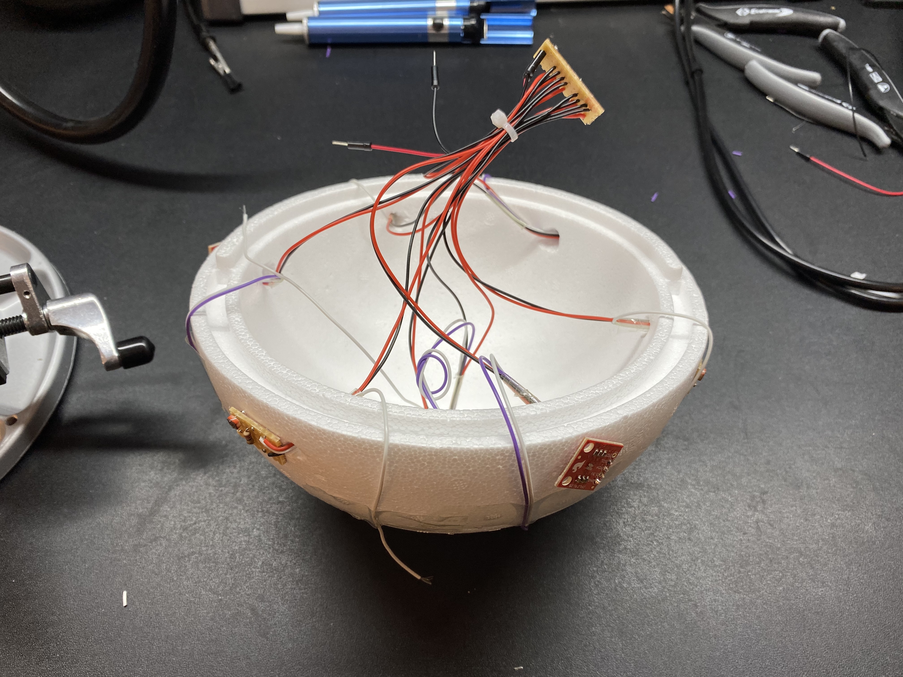
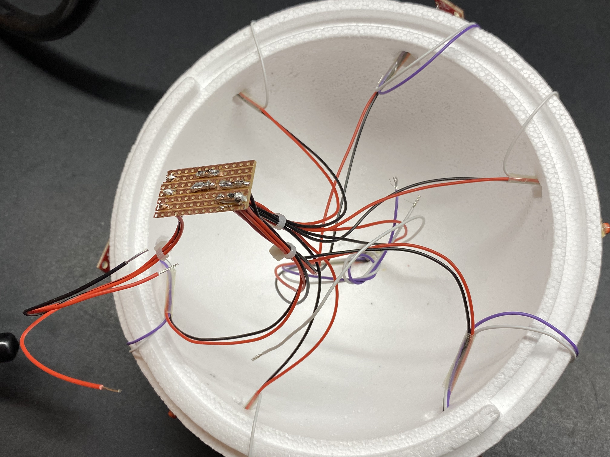
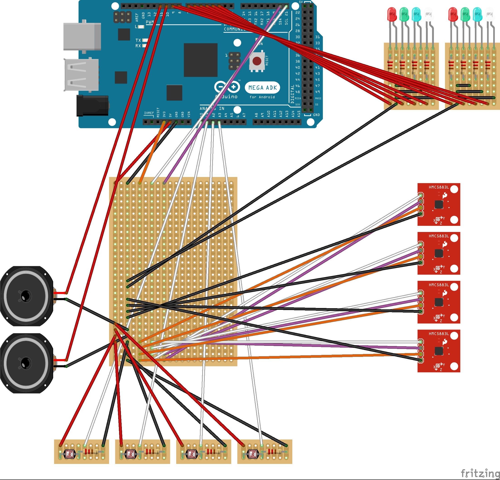

# Week 3

I have received my new board!


### Dealing with color values

Since I now have my hands on a suitable board and my color sensors, I can fetch some readings. The ISL29125s require an external library which is downloadeable from the makers website. Also, they are read through the I2C ports, which I have never used before. Luckily it is easy to read decimal and heximal values through Arduino. The latter is not of importance for me. The difference can be seen by including DEC or HEX as a second argument in the Serial.println() function.

- DEC = decimal
- HEX = hex color values


### I2C Ports

The Uno uses the A4 & A5 for SDA and SLA. It took me quite some time to figure out which ports the Mega uses, when finally I realized it has dedicated pins. How many Devices can you Connect to the I2C Bus? Connecting all four RGB sensors yields incorrect results. This is a problem I will have to address later. Here are some good resources I found on I2C connections:

- https://www.bluedot.space/tutorials/how-many-devices-can-you-connect-on-i2c-bus/
- http://www.goodliffe.org.uk/arduino/i2c_devices.php
- https://www.bluedot.space/tutorials/how-many-devices-can-you-connect-on-i2c-bus/
- https://maker.pro/arduino/projects/arduino-speaker
- https://forum.arduino.cc/index.php?topic=77447.0
- https://www.programmingelectronics.com/an-easy-way-to-make-noise-with-arduino-using-tone/

### Photoresistors

Getting a single reading was unreasonably teadious. I quickly realized all sensors had to be in parallel autonomous, or they would multiply themselves. Hence, I will solder little breakout boards that individually connect to the board and have independent power supplies. A good debugging tool is the multimeter, as I can test if there is current on the breakout board. Even at peak brightness, the Arduino seems to receives less current than it outputs, when run through a photoresistor.


```c++
int brightness = 0;

void setup() {
  pinMode(A0, INPUT);
  Serial.begin(9600);
}

void loop() {
  brightness = analogRead(A0);
  brightness = map(brightness, 599, 880, 0, 255);
  Serial.println(brightness);
  delay(500);
}
```

### Power and ground

Before I realized that both sensor types require different power supplies because 5V will break one of kind… Painstaikingly had to solder it a third time after the perfboard chipped on me (the usual). The solder doesn't bond well to the copper at all.



Just had David Crow pop up behind me and explain my project to a group of visitors. Practice makes perfect, I guess. Hope I don't spot another mistake now. This compartementalizes power and ground to make things easier. Since I only have very limited power pins on the arduino, it's necessary to bring everything together anyways.



I keep ground in the center lane. The 3.5V is on the left, the 5V on the right lane next to center.

### Testing the circuit

All the sensors seem to be getting their electricity. Tested both lanes with 3.5V from the Arduino. I get 3.322V on both of them, is this their combined resistance? Checked the current straight from the Aruduino which is 3.341V. Where is the 0.178V being lost?


### Bi-Directional Logic Level Converter

Even though I can power the sensors with 3.5V, it appears like I need a logic level converter between the SDA/SCL and serial pins on the Arduino.

> "Connect SDA on the breakout to A4 on the Uno, SCL to A5 on the Uno. If you're using the Uno or any 5V Arduino, you'll need a logic level converter between SDA/SCL on the breakout and A4/A5 on the Uno."

I have ordered one "SparkFun Logic Level Converter - Bi-Directional" with the hopes of being able to connect all my sensors to it at once. Here is it's hookup guide: https://learn.sparkfun.com/tutorials/bi-directional-logic-level-converter-hookup-guide. In the end I realized that a logic level converter was not necessary, as the readings from the RGB sensors don't have to be perfectly accurate to create an interesting tone.

### Schematic

I later figured this wasn't a propper schematic, and remade it in eagle. See log 9.


