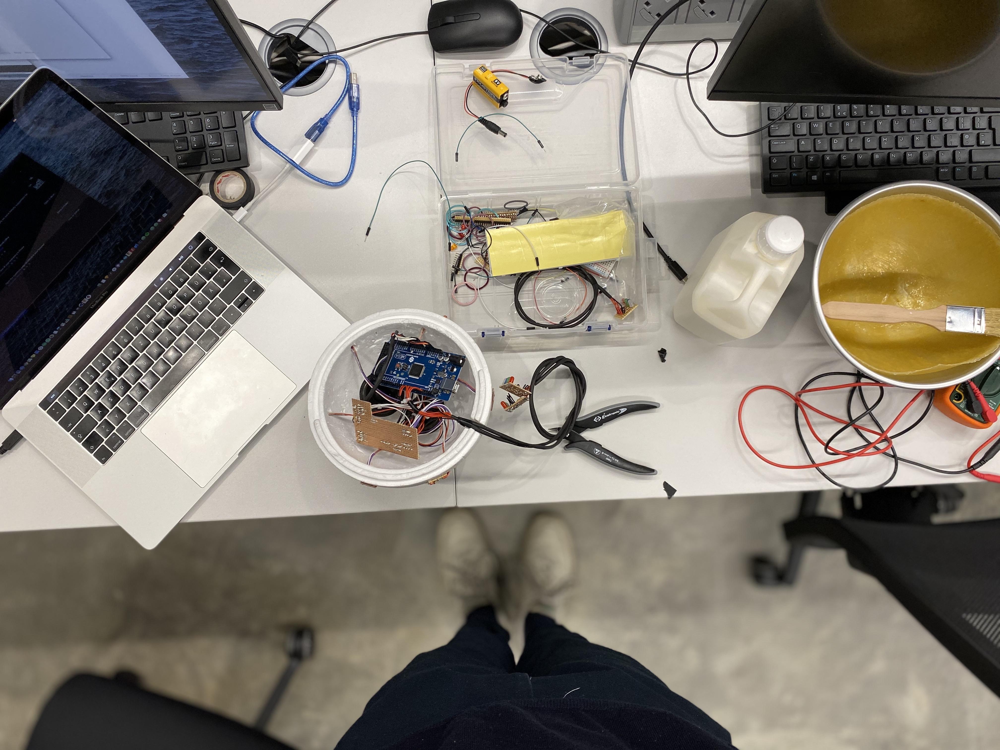
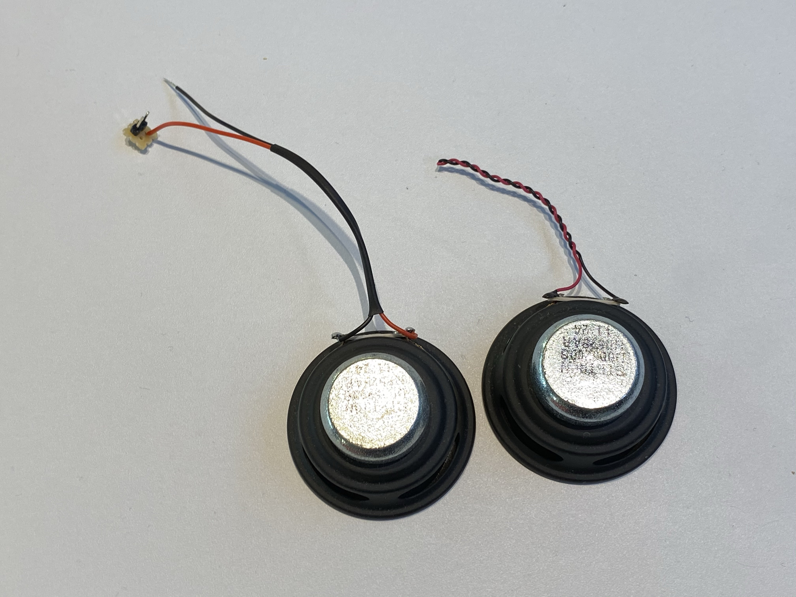
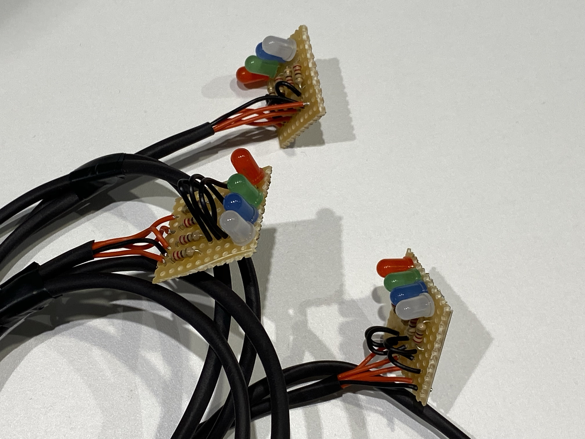
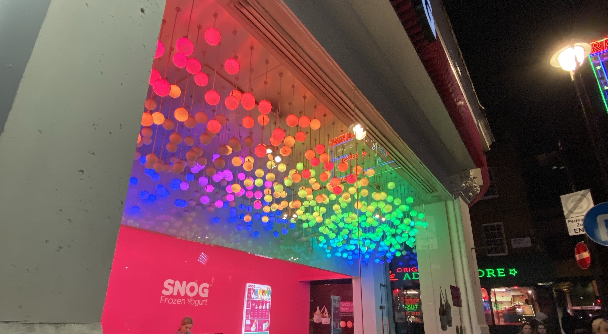
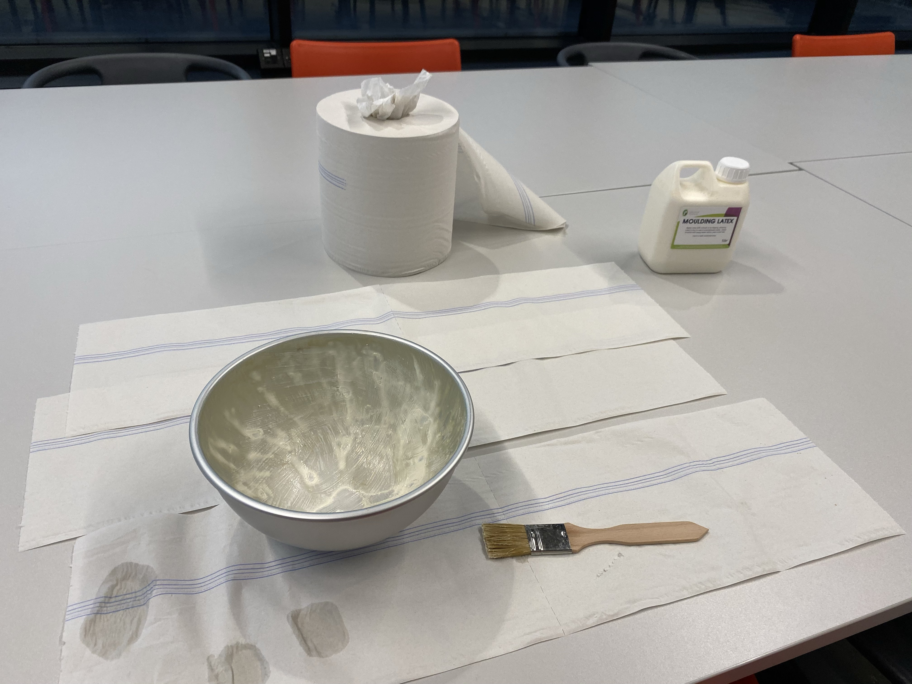
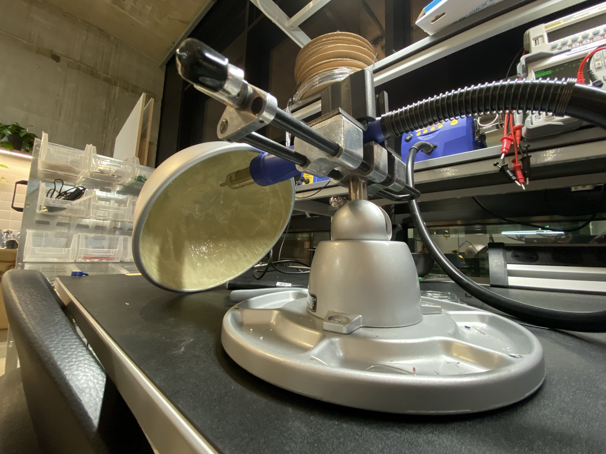
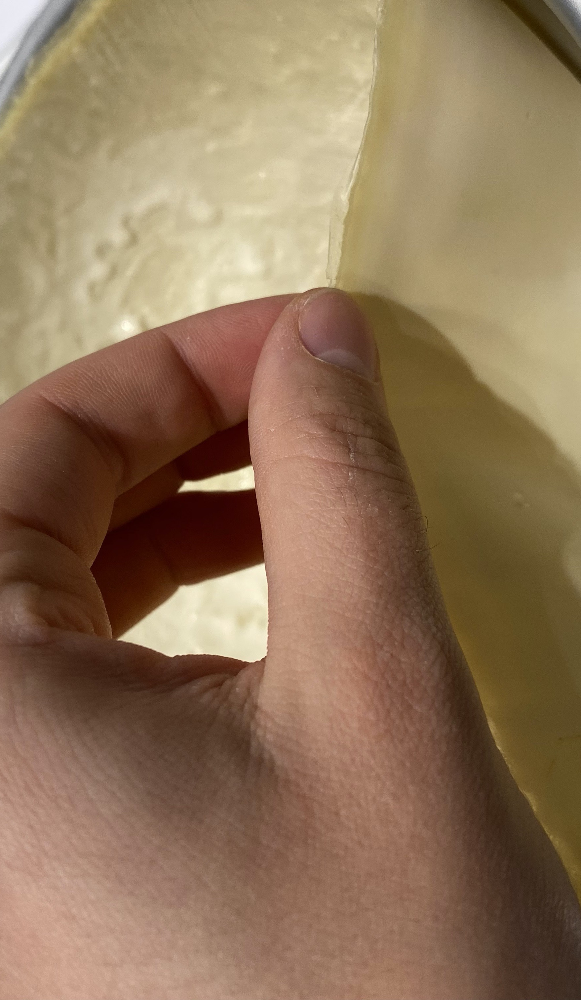
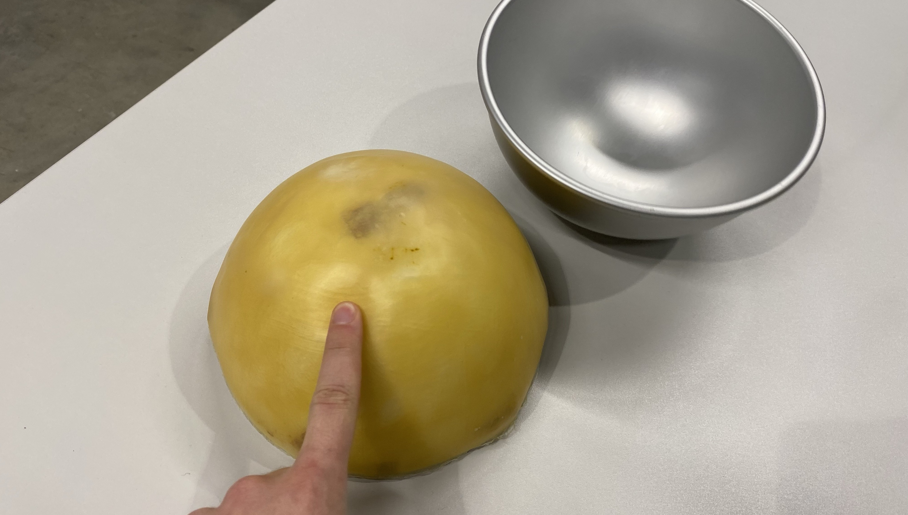
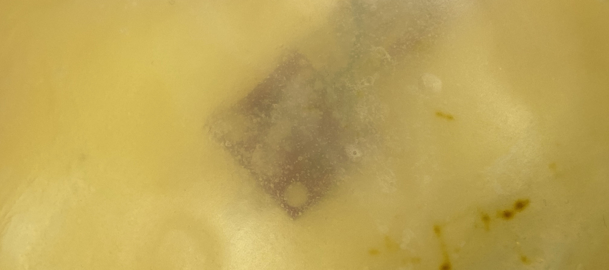
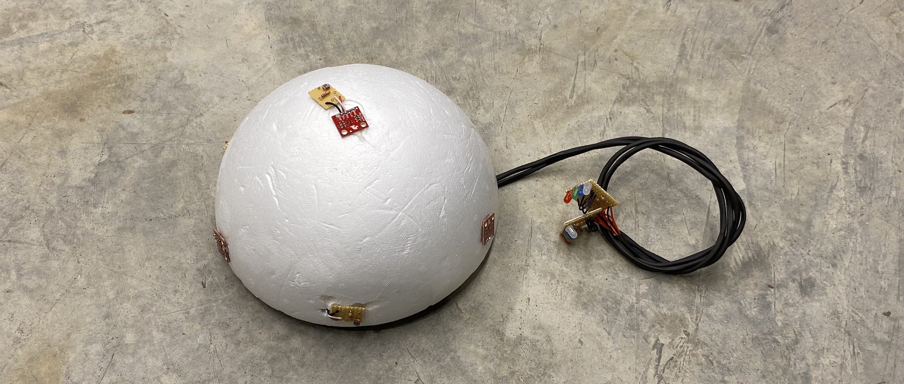

# Log 5

### Loudspeakers

Time for the first outputs! The loudspeakers have arrived and are working like a charm. I have found an open source tone library that simplifies the creation of melodies. Since they came with a wobbly cable and some sort of female plug I stripped them and resoldered the connection. Using hot glue, I will glue them to the inside of the dome, projecting downwards. This will disperse the sound more evenly compared to just chucking them in loosely with all the other components (the underground surface disperses the sound waves). Also, this saves space.

https://youtu.be/ip19ULygueg

### LEDs

LED strips, soldered in parallel. These can be individually accessed through the megs PWM pins.

https://youtu.be/iWTKAIUq5a8

https://youtu.be/PpH0G7DInRk

### Casing

I've bought silicone to cast a membrane that will act as my casing. It should be semi-translucent and ideally colorless. It's purpose is to hide the wiring, hence making it more approachable for the audience. I want to create a mistery around my piece, and give it a uncanny flesh like texture. The LED torches will be cast from the same material. PS3 had these neat accessory controllers (Sony PlayStation 4 Move controller set), this would be ideal:

Some more inspiration I found in a shop in china town:

Getting my hands dirty. Working with latex is not as easy as it looks. It dries rather slowly. Its difficult to create the right thickness. Also, it will take on any bristle strokes from the brush you are using to coat the mold. Furthermore, it changes color and becomes brown. I haven't figured why this is the case, either because it reacts to light or my tote bag.

Half an hour into drying time the silicone appeared competely opaque with little color tint. A day after the casting the silicone turned semitransparent, albeit having taken on a very distinct color. This will skew sensor readings. The texture is perfect though. I'll need to find a similar, colorless material.

### Final Interior

The interior is finalized. All components fit into the inside and are functional. A battery will power the arduino. I have cut an opening into the dome for the cables to exit. These will conenct the LED torches to the main perfboard. The loudspeakers are glued to the inside of the dome using hot glue and are projecting downwards. This reduces the chance of accidentally shortcuiruiting the board, as metal parts can touch.

