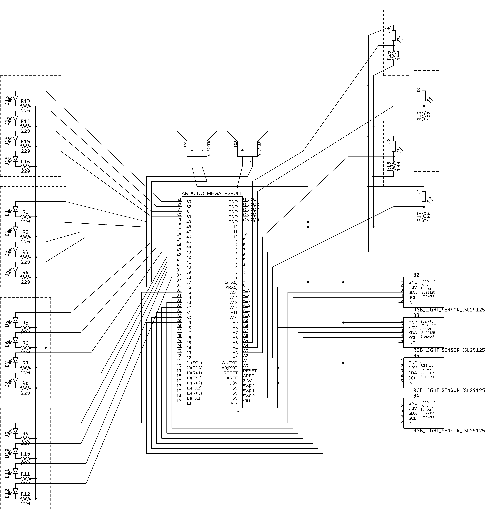

# Log 9

### Naming

My aunt hinted that what I had created already existed, and was called a Theremin. Albeit this being an instrument that works with a single input and a single output, the core concept seemed to be similar to mine: to create music without direct physcial interaction. Therefor, I chose to adapt the name Theremin. Here is a short description of the original instrument, found on Wikipedia:

_The theremin is an electronic musical instrument controlled without physical contact by the thereminist. It is named after its inventor, Léon Theremin, who patented the device in 1928._

### Adding a calibration routine

Working with light, calibration is crucial. Light changes constantly—even dark rooms differ in ambient lighting. I could'nt propperly showcase my project in CCi as the building is covered in glass. However, my feedback was to add a calibration routine to my script, in order for Theremin to automatically adjust to ambient light levels. This code represents a single calibration routine, taken from an Arduin tutorial:

```c++
// These constants won't change:
const int sensorPin = A0;    // pin that the sensor is attached to
const int ledPin = 9;        // pin that the LED is attached to

// variables:
int sensorValue = 0;         // the sensor value
int sensorMin = 1023;        // minimum sensor value
int sensorMax = 0;           // maximum sensor value

void setup() {
  // turn on LED to signal the start of the calibration period:
  pinMode(13, OUTPUT);
  digitalWrite(13, HIGH);

  // calibrate during the first five seconds
  while (millis() < 5000) {
    sensorValue = analogRead(sensorPin);

    // record the maximum sensor value
    if (sensorValue > sensorMax) {
      sensorMax = sensorValue;
    }

    // record the minimum sensor value
    if (sensorValue < sensorMin) {
      sensorMin = sensorValue;
    }
  }

  // signal the end of the calibration period
  digitalWrite(13, LOW);
}

void loop() {
  // read the sensor:
  sensorValue = analogRead(sensorPin);

  // apply the calibration to the sensor reading
  sensorValue = map(sensorValue, sensorMin, sensorMax, 0, 255);

  // in case the sensor value is outside the range seen during calibration
  sensorValue = constrain(sensorValue, 0, 255);

  // fade the LED using the calibrated value:
  analogWrite(ledPin, sensorValue);
}
```

### Redoing the circuit diagram

I figured that the fritzing diagram I made was not actually a schematic. Since I had to redo this, I took the challenge to make it in Eagle, the program with one of the scariest interfaces I have ever seen (or lack thereof). Getting all of my sensors onto a single diagram proved to be quite difficult, as I quickly ran out of space for my nets.


