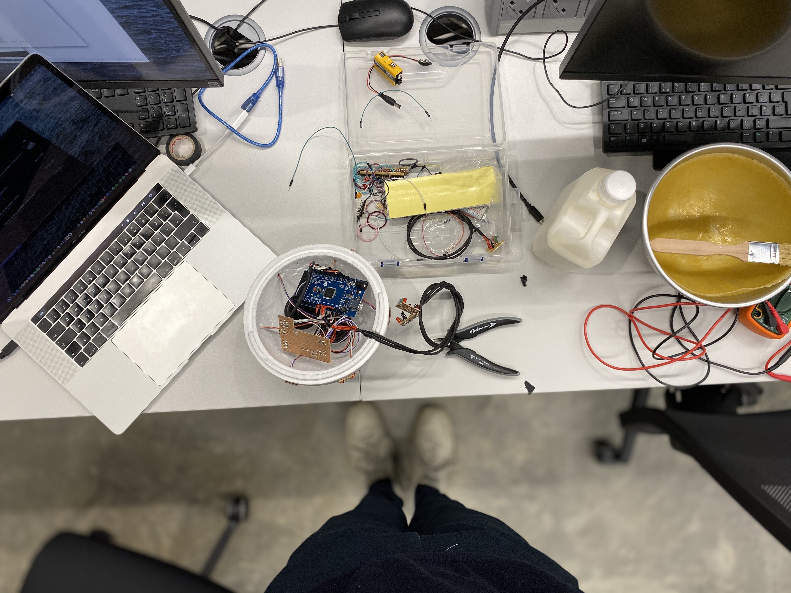
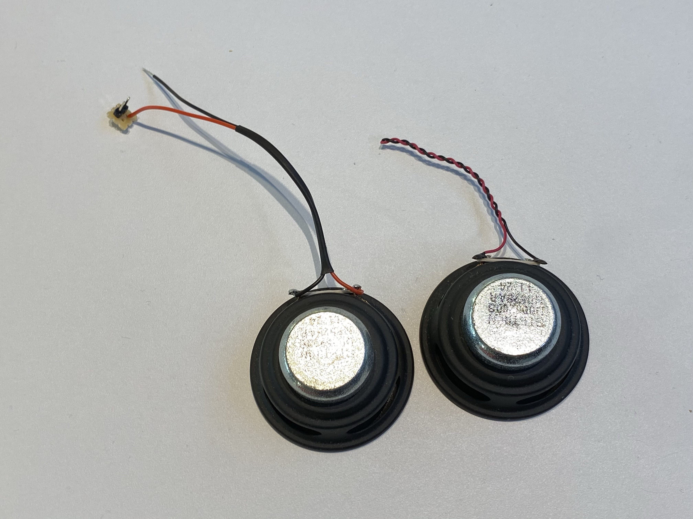
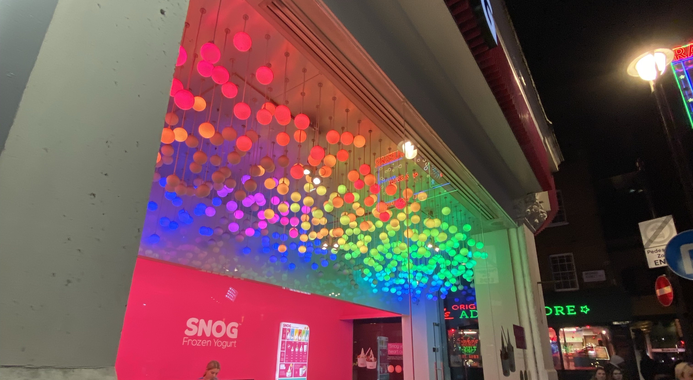
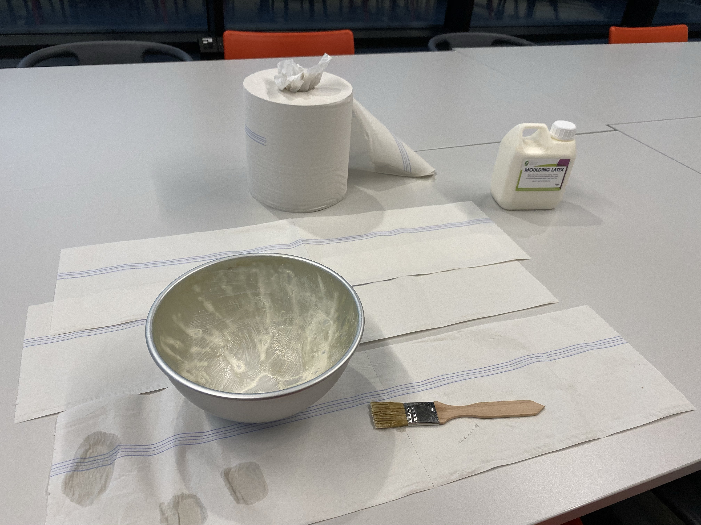
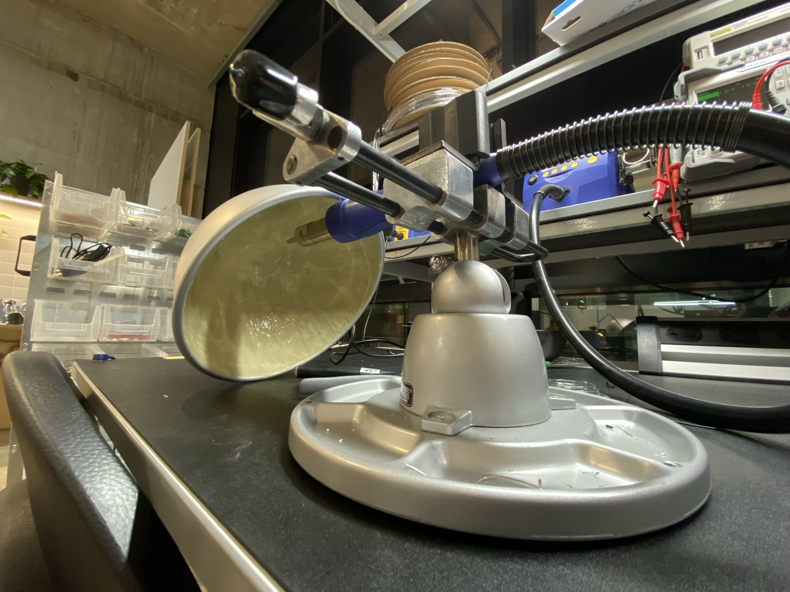
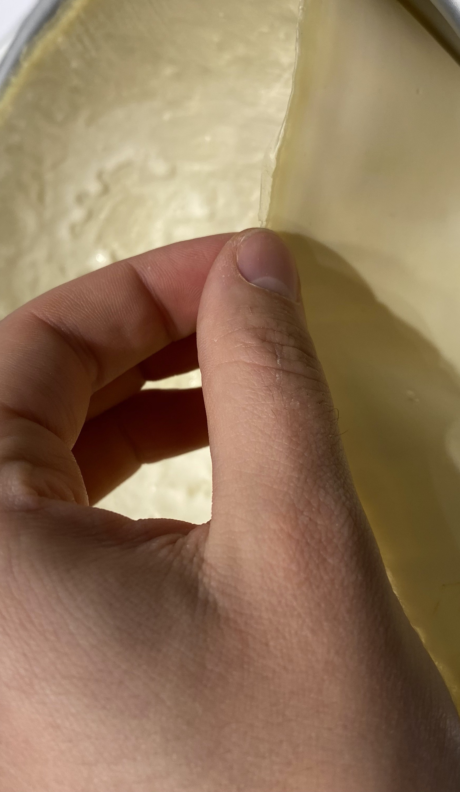
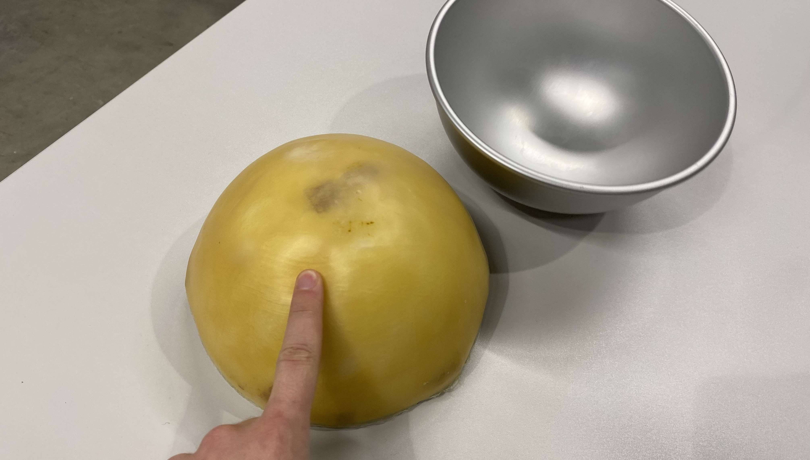
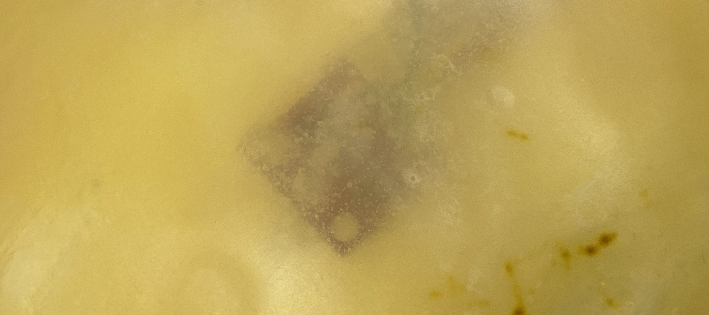
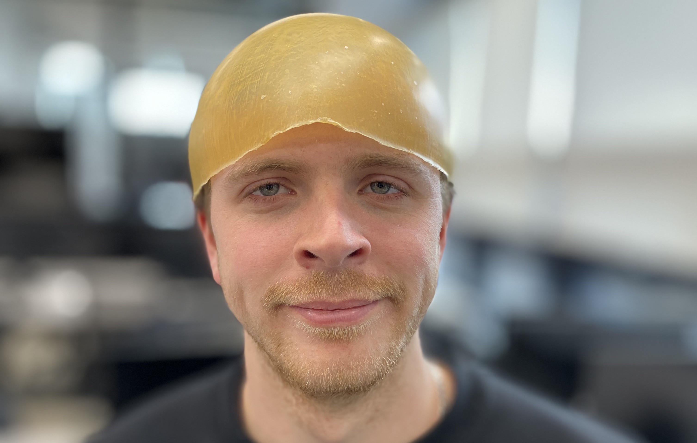
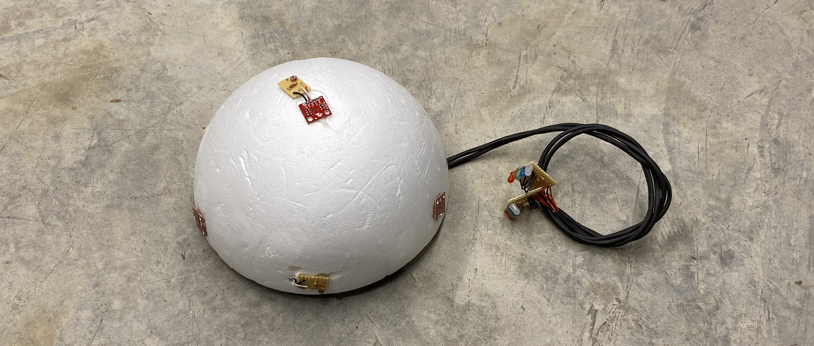

# Week 5



### Loudspeakers

The loudspeakers have arrived and are working like a charm. I have found an open source tone library that simplifies the creation of melodies. Since they came with a wobbly cable and some sort of female plug I stripped them and resoldered the connection. Using hot glue, I will glue them to the inside of the dome, projecting downwards. This will disperse the sound more evenly compared to just chucking them in loosely with all the other components (the underground surface disperses the sound waves). Also, this saves space.

https://youtu.be/ip19ULygueg



### LED

LED strips, soldered in parallel. These can be individually accessed through the megs PWM pins. When I tested this in the classroom I was quite amazed by how well the sensors were picking up the brightness. It was probably the shadow of my hand which triggered this, however.

https://youtu.be/iWTKAIUq5a8

https://youtu.be/PpH0G7DInRk


#### Pulse Width Modulation (PWM)

```C++
void loop () {
  // fade in from min to max in increments of 5 points:
  for (int fadeValue = 0 ; fadeValue <= 255; fadeValue += 5) {
    analogWrite(ledPin, fadeValue);
    delay(30);
  }

// fade out from max to min in increments of 5 points:
  for (int fadeValue = 255 ; fadeValue >= 0; fadeValue -= 5) {
    analogWrite(ledPin, fadeValue);
    delay(30);
  }
}
```

### Casing

I've bought silicone to cast a membrane that will act as my casing. It should be semi-translucent and ideally colorless. It's purpose is to hide the wiring, hence making it more approachable for the audience. I want to create a mistery around my piece, and give it a uncanny flesh like texture. The LED torches will be cast from the same material. PS3 had these neat accessory controllers, this would be ideal.

Some inspiration I found in a shop in china town:



Getting my hands dirty:




Half an hour into drying time the silicone appeared competely opaque with little color tint.



A day after the casting the silicone turned semitransparent, albeit having taken on a very distinct color. This will skew sensor readings. The texture is perfect though. I'll need to find a similar, colorless material.





### Final Interior

The interior is finalized. All components fit into the inside and are functional. A battery will power the arduino. I ahve cut an opening into the dome for the cables to exit. These will conenct the LED torches to the main perfboard. The loudspeakers are glued to the inside of the dome using hot glue and are projecting downwards.


