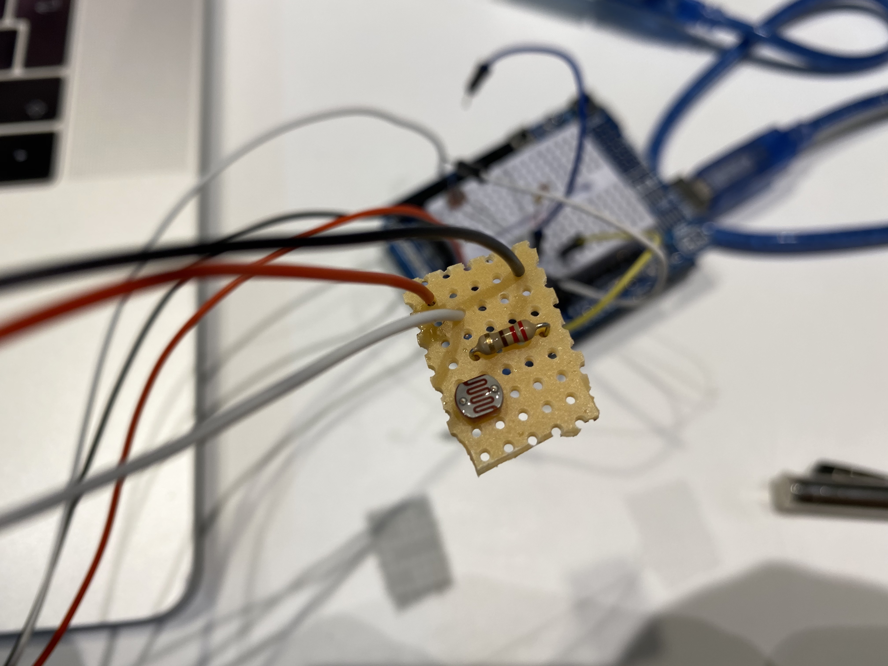
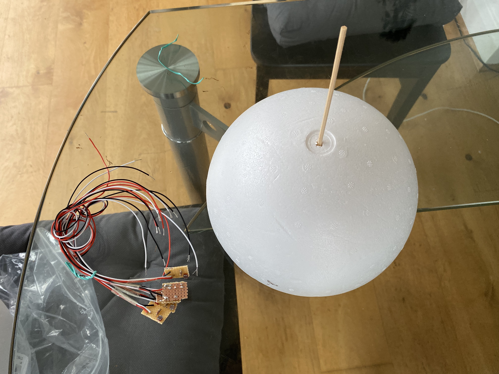
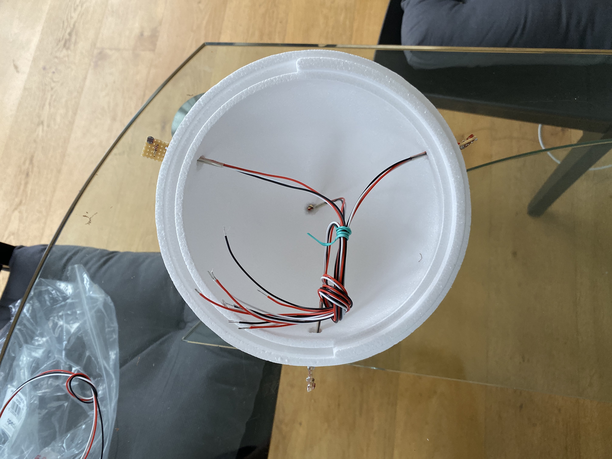
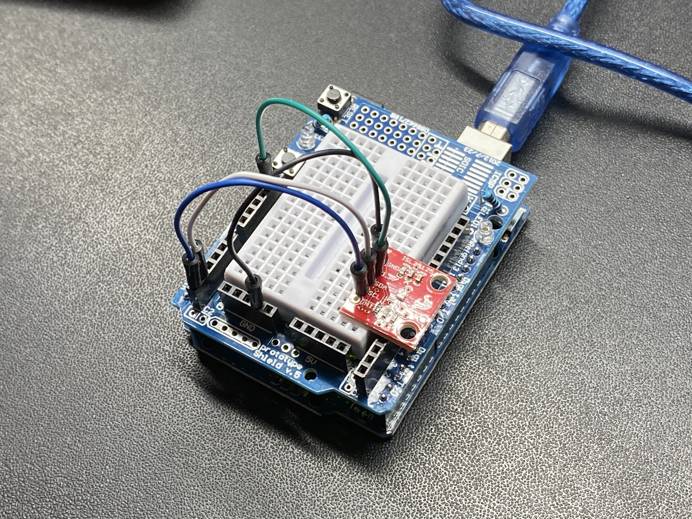
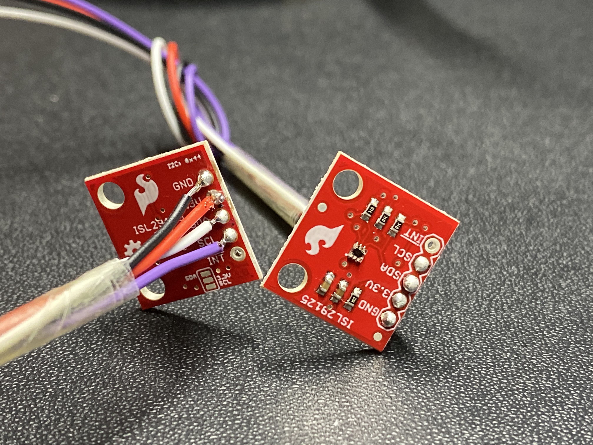
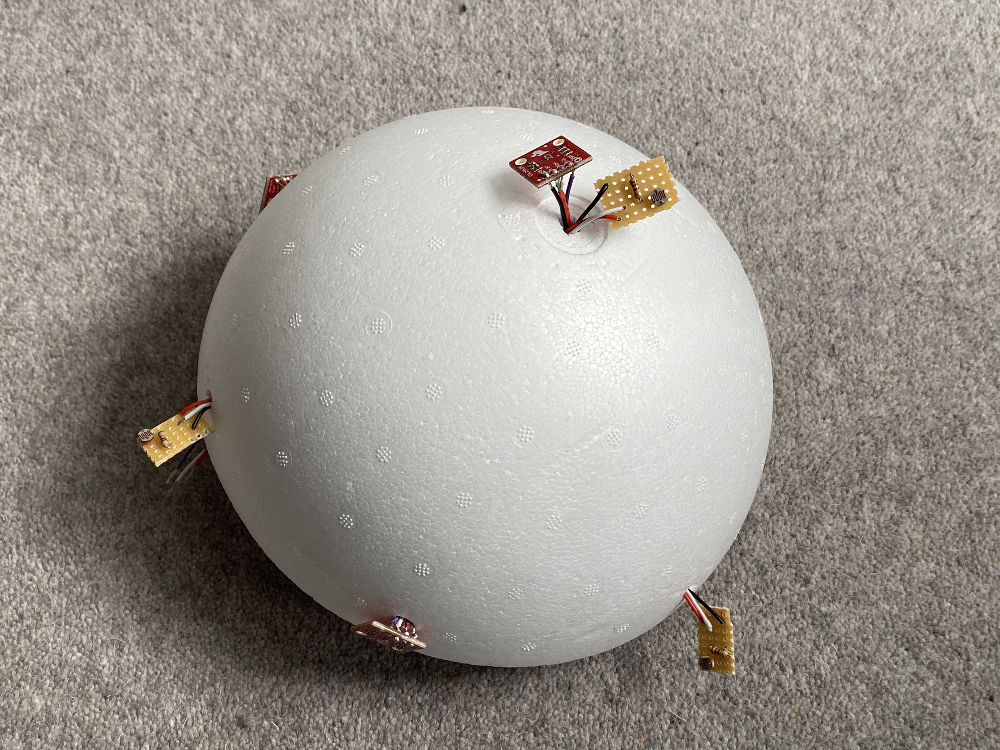

# Week 2

I've ordered 4 ambient light sensors. Initially, I wanted to go for 5 sensors of each sort but since spending such an amount of money didn't increase the accuracy much, I cut it down to four. 

In the meantime, I started soldering little breakout boards for the photoresistors. Not only will this reduce the cable salad on my central perfboard by compartmentalizing the components, but it'll also be more reliable. 

Taping the cables together close to the breakout board will helpfully spread force to all of the cables should they be accidentally pulled. This'll hopefully reduce the chance of a cable getting lose. Since I'm dealing with so many sensors at once, it'll be a nightmare to spot errors if things go wrong. Better be safe then sorry.

For now I am using this styrophome ball to prototype. I poke holes into the ball in order to bring all the technology together on the inside. The sensors will be stuck, not floating around like in the picture.

The ambient light sensors have arrived and I am testing them out. They work! The output is in HEX color values—I hope Arduino provides an easy way to convert these to floating-point.

Bought my own Board, a Sunfounder Mega (SUNFOUNDER Mega 2560 R3). It accommodates 16 analog ins, whereas the leonardo only has 6. Since I need 12 and multiplexing is not an option, this is the optimal board.

