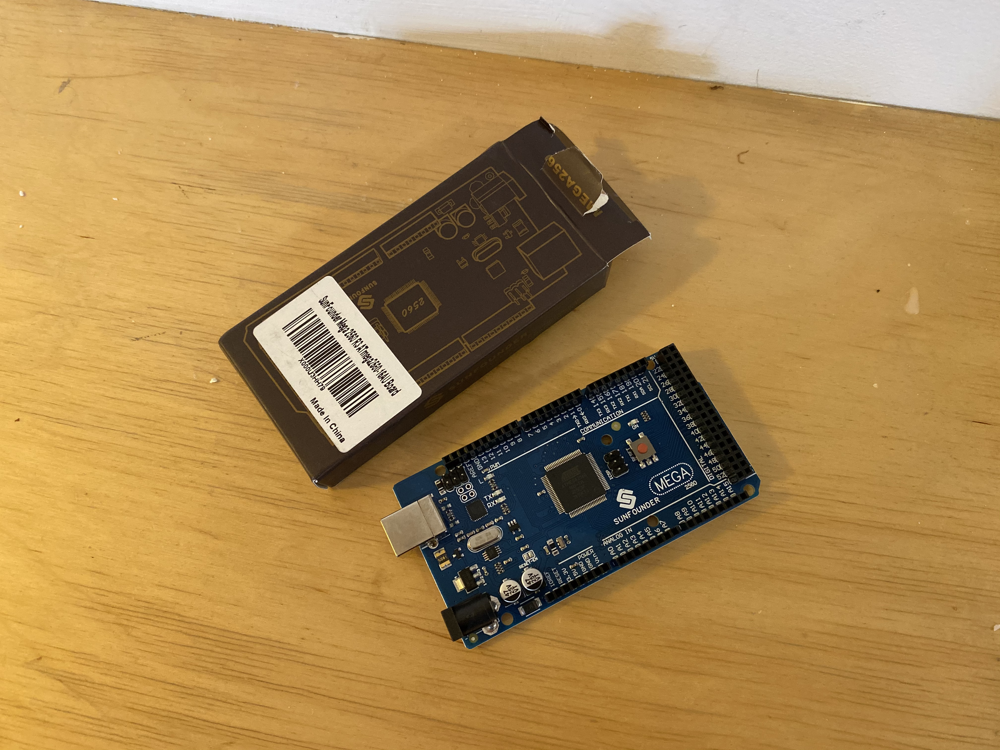

# Week 2

I've ordered 4 ambient light sensors. Initially, I wanted to go for 5 sensors of each sort but since spending such an amount of money didn't increase the accuracy much, I cut it down to four. 

In the meantime, I started soldering little breakout boards for the photoresistors. Not only will this reduce the cable salad on my central perfboard by compartmentalizing the components, but it'll also be more reliable. 

Bought my own Board, a Sunfounder Mega. It accommodates 16 analog ins, whereas the leonardo only has 6. Since I need 12 and multiplexing is not an option, this is the optimal board.

