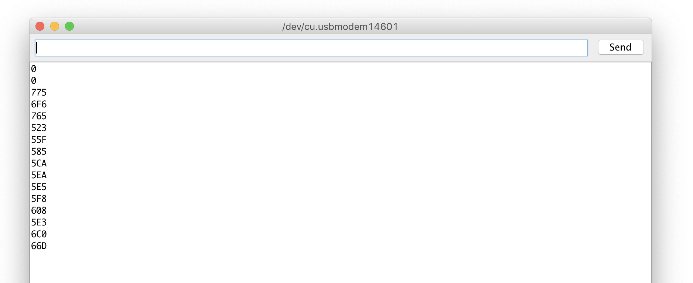

# Week 3
 
 ### Dealing with color values
 
 - DEC = decimal
 - HEX = hex color values
 
 
 
 
 ### I2C Ports on the Arduino
 
  __20(SDA) and 21(SCL) for Mega!__
 
 The Uno uses the A4 & A5 for SDA and SLA.

How many Devices can you Connect to the I2C Bus?

https://www.bluedot.space/tutorials/how-many-devices-can-you-connect-on-i2c-bus/
http://www.goodliffe.org.uk/arduino/i2c_devices.php

-> Wire.h library

You can daisy chain several of these devices together, providing each device has a unique address.

Arduino Uno :
SDA goes to pin A4,
SCL goes to pin A5.

### Getting photoresistors to work

map(value, fromLow, fromHigh, toLow, toHigh)

```c++
int brightness = 0;

void setup() {
  pinMode(A0, INPUT);
  Serial.begin(9600);
}

void loop() {
  brightness = analogRead(A0);
  brightness = map(brightness, 599, 880, 0, 255);
  Serial.println(brightness);
  delay(500);
}
```
### Parallel pohotoresistors

Works at cost of accuracy. Every subsequent resistor will have less impact on the output. Mapping necessary.


Testing for current = 3.322V
Fresh out of arduino = 3.341V

### Soldering power and ground

Before I realized that both sensor types require different power supplies because 5V will break one of kind… Painstaikingly had to solder it a third time after the perfboard chipped on me (the usual). The solder doesn't bond well to the copper at all.


Just had David Crow pop up behind me and explain my project to a group of visitors. Practice makes perfect, I guess. Hope I don't spot another mistake now. This compartementalizes power and ground to make things easier. Since I only have very limited power pins on the arduino, it's necessary to bring everything together anyways.


I keep ground in the center lane. The 3.5V is on the left, the 5V on the right lane next to center.

### Testing the circuit

All the sensors seem to be getting their electricity. Tested both lanes with 3.5V from the Arduino. I get 3.322V on both of them, is this their combined resistance? Checked the current straight from the Aruduino which is 3.341V. Where is the 0.178V being lost?


