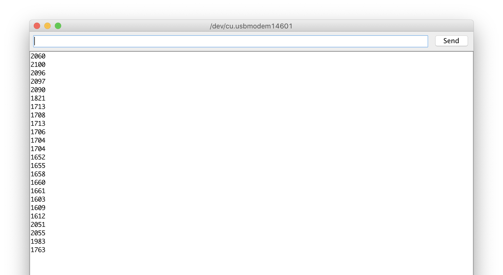

# Week 3
 
 ### Dealing with color values
 
 DEC = decimal
 HEX = hex color values
 
 
 
 
 ### I2C Ports on the Arduino
 
  __20(SDA) and 21(SCL) for Mega!__
 
 The Uno uses the A4 & A5 for SDA and SLA.

How many Devices can you Connect to the I2C Bus?

https://www.bluedot.space/tutorials/how-many-devices-can-you-connect-on-i2c-bus/
http://www.goodliffe.org.uk/arduino/i2c_devices.php

-> Wire.h library

You can daisy chain several of these devices together, providing each device has a unique address.

Arduino Uno :
SDA goes to pin A4,
SCL goes to pin A5.

### Getting photoresistors to work

map(value, fromLow, fromHigh, toLow, toHigh)

```c++
int brightness = 0;

void setup() {
  pinMode(A0, INPUT);
  Serial.begin(9600);
}

void loop() {
  brightness = analogRead(A0);
  brightness = map(brightness, 599, 880, 0, 255);
  Serial.println(brightness);
  delay(500);
}
```
### Parallel pohotoresistors

Works at cost of accuracy. Every subsequent resistor will have less impact on the output. Mapping necessary.


