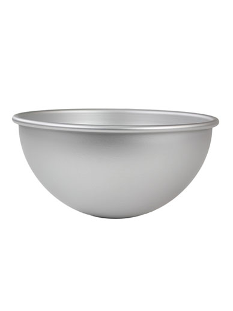
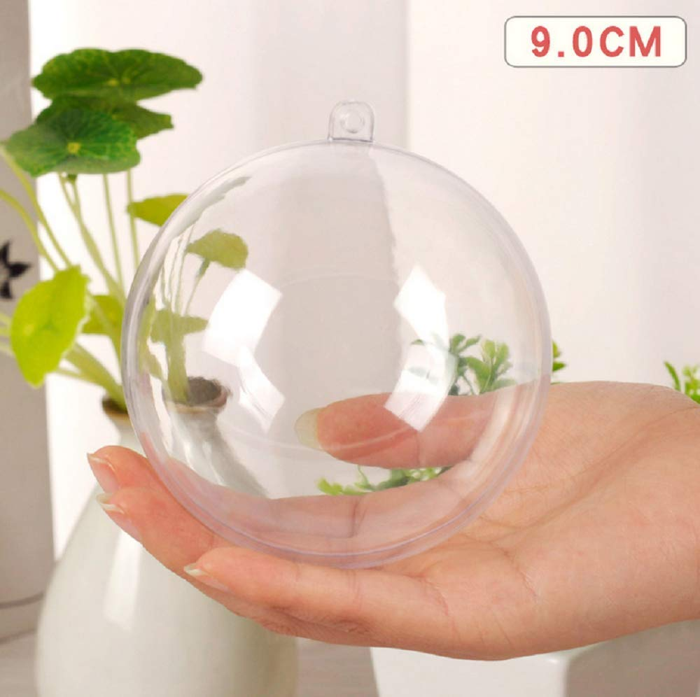
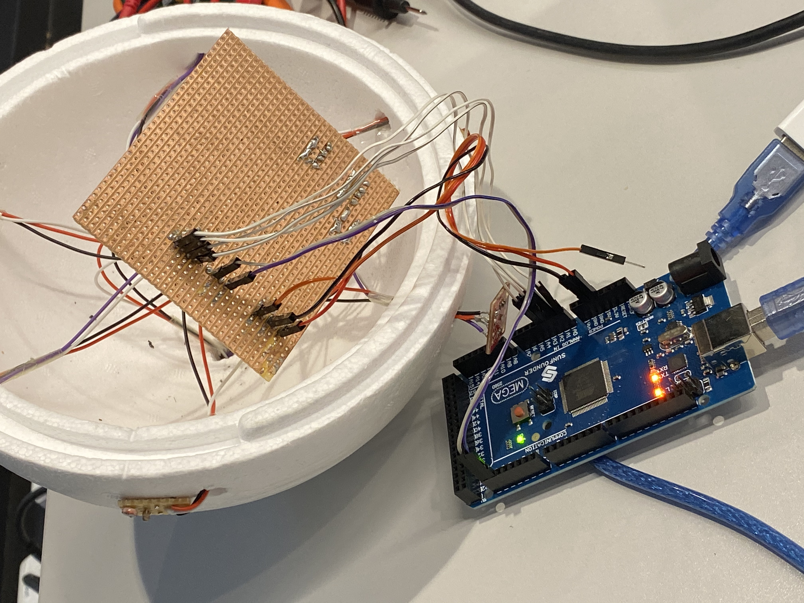
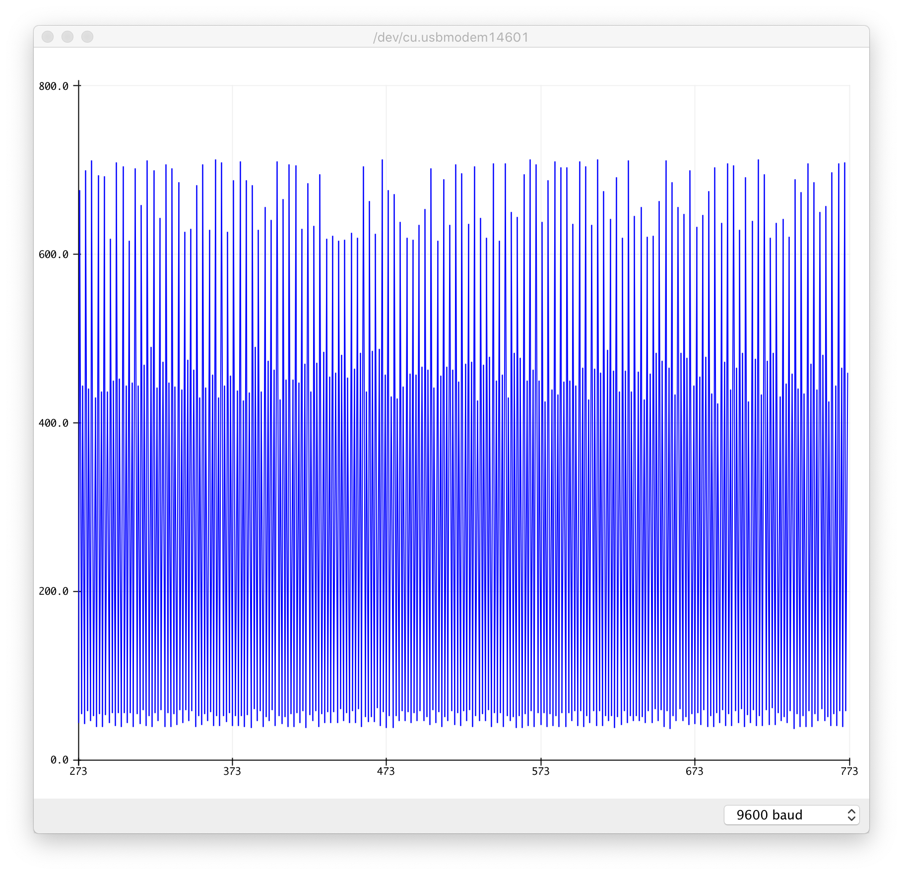
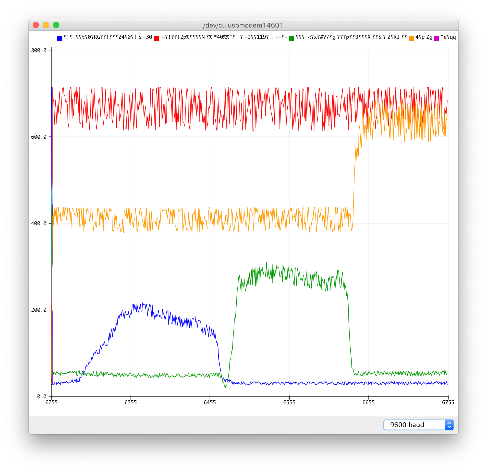
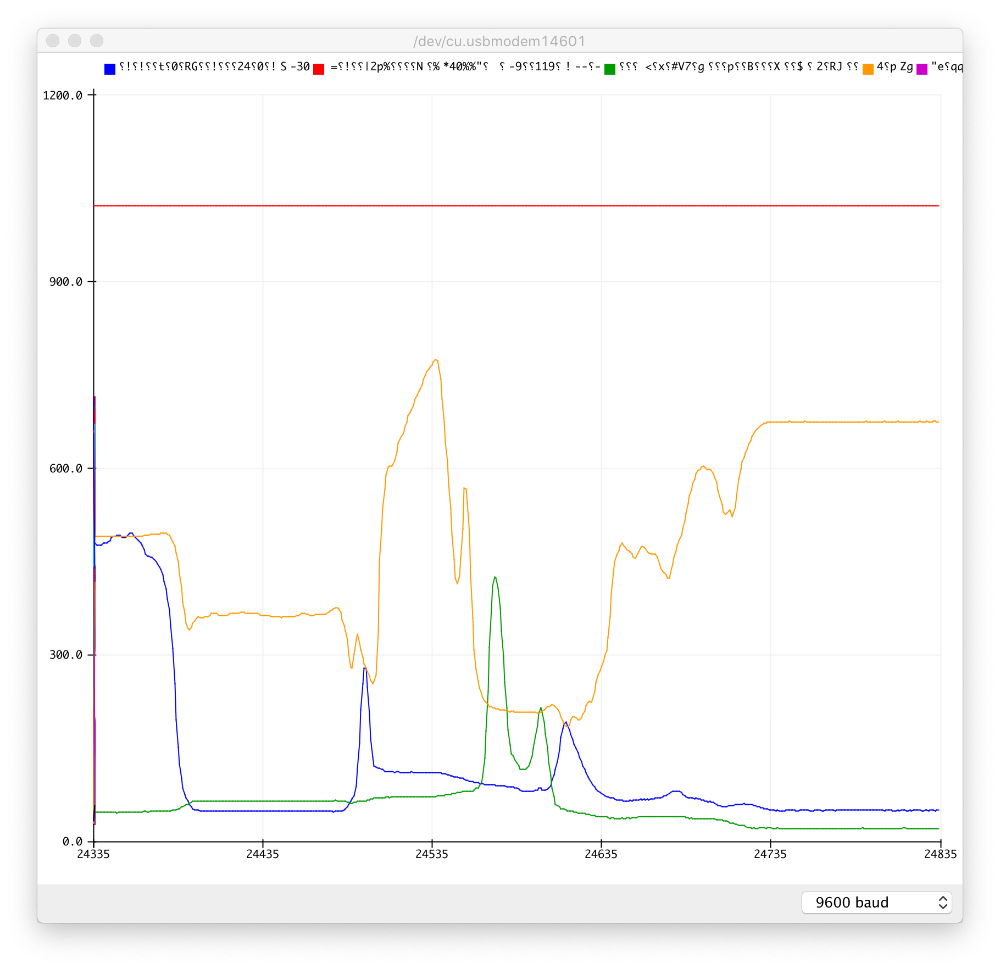

# Week 4

## Physical Encasing

I have ordered a shperical cake form that will act as a mold for the outer skin of the semi–globe. I will cover the inside with a medium layer of silicone that I'll buy in the art shop. An outer skin will cover up the sensors, making the object more approachable, aesthetic and mysterious (by hiding i'ts functions). Further more, it will slightly even out light shown at the globe, in order to get better sensor readings.



I will create small globe torches in similar fashion. These are the molds I have ordered. Their internals will be simple--an array of LEDs connected to the arduino by distance. This'll allow programming light sequences, fading, and potential interaction.



## Resoldering

My compartmentalized approach made me run out of space. I've resoldered everything to a single, large perf board.



## Testing all the sensors at once

Before speration:



```c++
float brightness = 0;

void setup() {
  Serial.begin(9600);
}

void loop() {
  // brightness = analogRead(A0);
  // brightness = map(brightness, 599, 880, 0, 255);

  Serial.print(analogRead(A0));
  Serial.print(",");
  Serial.print(analogRead(A1));
  Serial.print(",");
  Serial.print(analogRead(A2));
  Serial.print(",");
  Serial.print(analogRead(A3));
  Serial.println(",");
}
```

Using 3.5V:



The mega can take a **max. stable baud rate of 115200**. This runs quicker but will choke the monitor/plotter when there is a mistake in the code. Using 5V will yield a much cleaner out. It's rather satisfying to watch this:



## To–do

- [ ] 4th photoresistor isn't working. Find out why.
- [ ] Set ISLs to different addresses so that they can be individually read out.
- [ ] Find out why speaker_start() miraculously isn't in scope, altough other files are.
- [ ] Find out how to play 2 speakers at same time

<https://www.bluedot.space/tutorials/how-many-devices-can-you-connect-on-i2c-bus/> <https://maker.pro/arduino/projects/arduino-speaker> <https://forum.arduino.cc/index.php?topic=77447.0><https://www.programmingelectronics.com/an-easy-way-to-make-noise-with-arduino-using-tone/>
